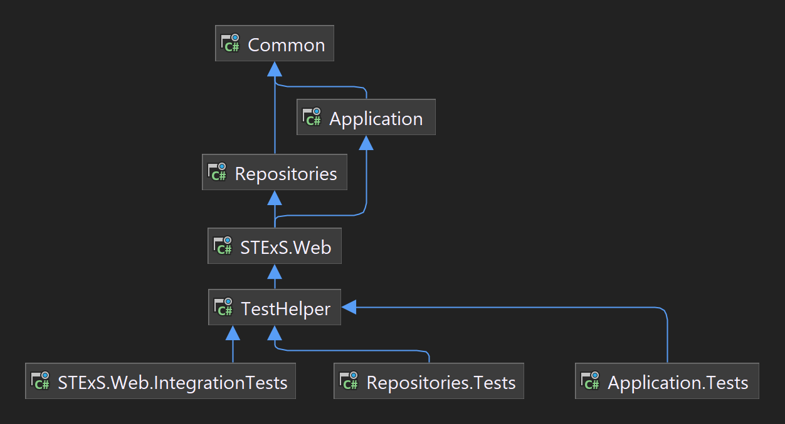
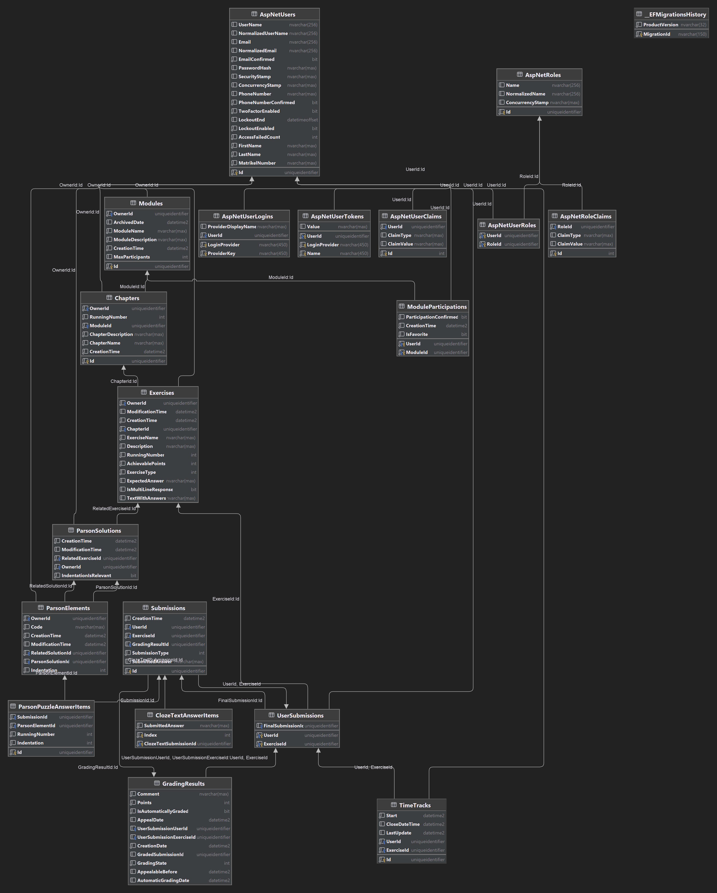

# Ausführen mittels Docker
- die Anwendung und all ihre Abhängigkeiten zu installieren ist aufwendig. Es bietet sich daher an, die Container Images, welche durch die Github Actions gebaut werden auszuführen
- dazu muss docker und docker-compose installiert sein
- dazu folgende docker-compose.yml Datei verwenden und im Ordner der Datei `docker-compose up` ausführen
```yaml
version: '3.9'
services:
  stexs-db:
    image: mcr.microsoft.com/mssql/server:2022-latest
    environment:
      - ACCEPT_EULA=Y
      - SA_PASSWORD=Adminxyz123!
    ports:
      - "1433:1433"
  stexs-backend:
    image: ghcr.io/niposch/stexs-backend:latest
    ports:
      - "5000:80"
    expose:
      - "80"
    restart: on-failure
    depends_on:
      - stexs-db
    environment:
      - DontBuildSwagger=true
      - ASPNETCORE_ENVIRONMENT=Development
  stexs-frontend:
    image: ghcr.io/niposch/stexs-frontend:latest
    ports:
      - "80:80"
    restart: on-failure
    depends_on:
      - stexs-backend
```
- nachdem alles gestartet ist sollte die Anwendung unter: `http://localhost` erreichbar sein
- in der Readme.md ist beschrieben, was getan werden muss um das Projekt auszuführen
# Struktur des Projekts
- um mit diesem Projekt zu arbeiten ist Wissen über die verwendeten Technologien unerlässlich.
- Frontend Entwickler sollten sich mit Angular und Typescript, Angular HTML und SCSS auseinandersetzen
- Backend Entwickler sollten sich mit .NET 6, C#, Entity Framework und Dependency Injection auseinandersetzen
## Frontend
- orientiert sich am typischen Aufbau eines Angular Projekts.
	- 
	- pipes, components, layouts und guards => Angular Konzepte
- 
	- Komponenten sind in Unterordner organisiert
- 
	- Jede Komponente besteht aus 4 Dateien. 
		- `*.ts ` Datei enthält Code 
		- `*.spec.ts` enthält Tests
		- `*.scss` Enthält komponentespezifisches Stylesheet
		- `*.html`: Angular HTML
	- Komponenten werden in der app.module.ts importiert (geschieht i.d.R. automatisch durch Angular cli)
- Komponente, Pipes und Guards können durch die Angular CLI generiert werden `ng generate component [component-name]`
- Weitere Informationen über die Bestandteile des Frontends sind der Frontend Dokumentation zu entnehmen => `yarn docu` (dazu muss `yarn quickstart` mindestens 1 mal ausgeführt wurden sein)
- für Entwicklungszwecke wird das Projekt durch `yarn quickstart` gestartet
- Services werden durch Code Generation anhand der `swagger.json` Datei erstellt wenn `yarn quickstart` ausgeführt wird.
	- damit die `swagger.json` Datei generiert, muss das Backend gebaut/ausgeführt werden
	- Die generierten Services erleichtern die Kommunikation mit dem Backend, da alle im Backend verfügbaren Routen zu Services generiert werden (1 Service pro Backend Controller)
- es existiert ein Proxy der für Entwicklungszwecke API Calls vom Frontend von `/api*` an das Backend weiterleitet
	- dieser ist in proxy.conf.json konfiguriert
- Befehle wie `yarn quickstart` sind in der package.json Datei konfiguriert
## Backend
- es wird eine 3 Level Architektur verwendet, wobei Datenobjekte im Common Projekt gespeichert werden
	- STExS.Web
	- Application
	- Repository
- Dadurch wird die Wartbarkeit des Codes erhöht, da die Business Logik unabhängig von der Datenbank arbeitet
	- Bezug auf Datenbank wird durch Dependency Injection hergestellt. Dadurch wird Testbarkeit verbessert
- Dependency Injection wird Verwendet. Viele Services haben ein IService Interface, welches im Modul des Projekts (z.B. ApplicationModule.cs) registriert werden muss. => siehe bereits registrierte Services
- Verwendete Bibliotheken:
	- asp.net mit .NET 6
	- entity framework (Object Relational Mapper)
	- Testing:
		- AutoFac
		- Moq
	- Swagger => Swagger UI kann eingesehen werden unter: https://localhost:44345/api/swagger/index.html
		- routen können auch "ausprobiert" werden. Dazu bitte zuerst die login Route aufrufen
- 
	- Dependency Inversion wird angewandt, sodass das Application Projekt nur von Common abhäng
	- => es ist somit unabhängig von der Datenbank und der Ausgabe (Asp.net controllers etc.)
- Backend ist in 4 Projekte und 3 Testprojekte aufgeteilt
### Testprojekt
- Repositories.Tests und Application.Tests sind Unit Tests
- STExS.Web.IntegrationTests sind Integrationstests die Http Routen aufrufen
- Alle Tests verwenden eine in memory Sqlite Datenbank
- 
- Für jede zu testende Klasse existiert ein Ordner mit einer `Infrastructure.cs` von der alle der Testdateien erben
	- die Infrastructure Datei dient dem Setup und reduziert Codeduplizierungen
- Die Testdateien testen jeweils eine Methode auf der Klasse
### Common Projekt
- ein Projekt, welches i.d.R. kein Verhalten enthält
- es werden hier alle Datenobjekte die in der Anwendung verwendet werden abgelegt
	- diese werden mit dem Repository Projekt und mit dem Application Projekt geteilt
	- Repository nutzt diese Klassen u.A. um Tabellen in der Datenbank anzulegen
### Application Projekt
- Enthält Services in welchen die Anwendungslogik programmiert wird

### Repository Projekt
- Migrations Ordner enthält alle vom Entity Framework erstellten Migrationen
	- Siehe Readme wie Migrationen erstellt werden.
	- dies ist notwendig, wenn eine der Datenklassen in Common oder die Konfiguration in ApplicationDbContext verändert wird
	- Beziehungen können konfiguriert werden durch: 
		- EF Core Konventionen 
		- im ApplicationDbContext
		- oder in den \*EntityTypeConfiguration Dateien
- Datenbankdiagramm:
	- 
### STExS.Web Projekt
- das Projekt, welches ausgeführt wird
- enthält Controller die von asp.net benutzt werden um eine API für das Frontend bereitzustellen
	- diese Controller interagieren in der Regel nur mit den Services die vom Application Projekt bereitgestellt werden
- enthält in der Program.cs die Logik um das Projekt 'hochzuziehen' und registriert verschiedene Module (siehe Autofac) in die Dependency Injection
- Abhängigkeit zum Repository Projekt besteht nur, damit das Repository Projekt in die Dependency Injection registriert werden kann

## Konfiguration
- Konfiguration erfolgt über appsettings.json
- in der Datei kann ein SMTP Server für die Bestätigungsemails hinterlegt werden.
	- => Standartmäßig wird ein SMTP Testing Service verwendet [Free SMTP Server for Testing](https://www.wpoven.com/tools/free-smtp-server-for-testing#)
	- Emails können eingesehen werden, indem die [Website](https://www.wpoven.com/tools/free-smtp-server-for-testing#) aufgerufen wird und stexs@niposch.de eingegeben wird
	- Test service versendet keine E-Mails!
- Für Entwicklungszwecke sind standardmäßig 3 Accounts angelegt

| email             | passwort | rolle |
| ----------------- | -------- | ----- |
| dev@test.com      | Test333! | Admin |
| dev-teacher@test.com | Test333! | Lehrer      |
| dev-user@test.com | Test333! | Student      |


# Bekannte Fehler
- Kapitel mit Teilnehmern können nicht gelöscht werden
	- => es wird keine Fehlermeldung dem Nutzer gegeben
- Punktzahlen werden den Studenten nicht auf der Chapter Liste angezeigt
- Fehlermeldungen des Backends werden in der Regeln nicht dem Nutzer angezeigt
- einige der Descriptions sind Required und können daher nicht leer gelassen werden
    - es kann unter Umständen zu Fehlern kommen, welche das Speichern verhindern
- Löschen Funktionen (von Module, Kapiteln und Aufgaben) Funktionieren unter Umständen nicht
- UI unterstützt keine Mobilgeräte
- Einige der Metriken auf dem Data Dashboard sind nicht implementiert
- Hinweis bei Cloze Text Erstellung erscheint nicht