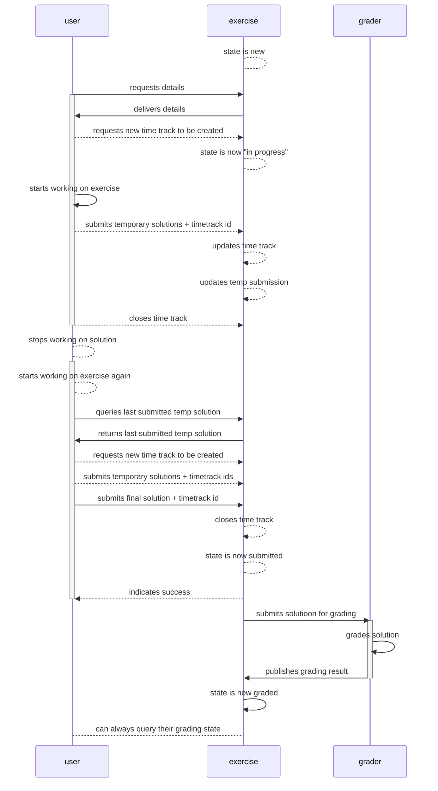
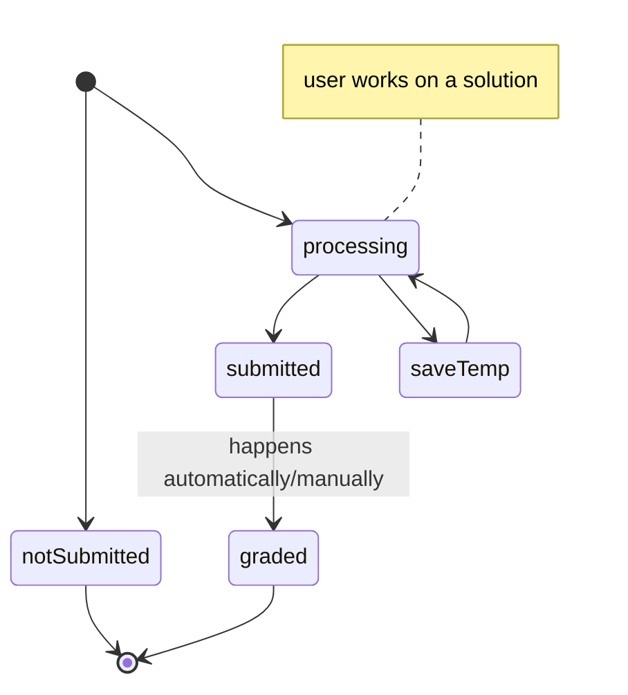
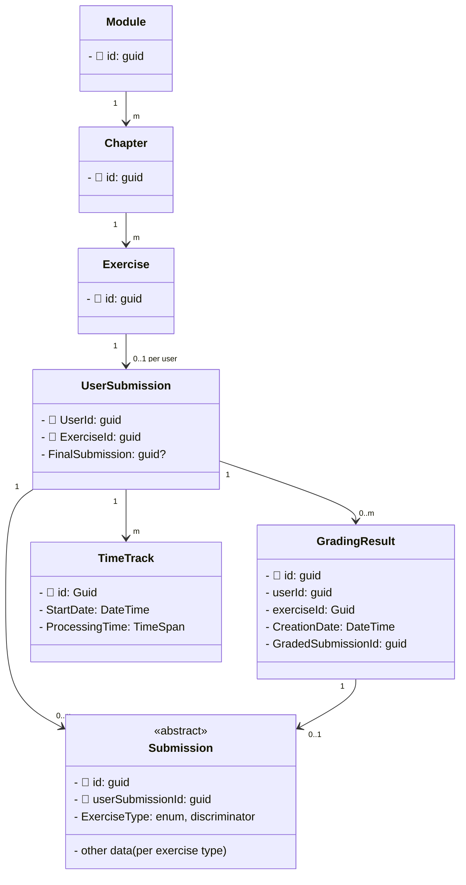
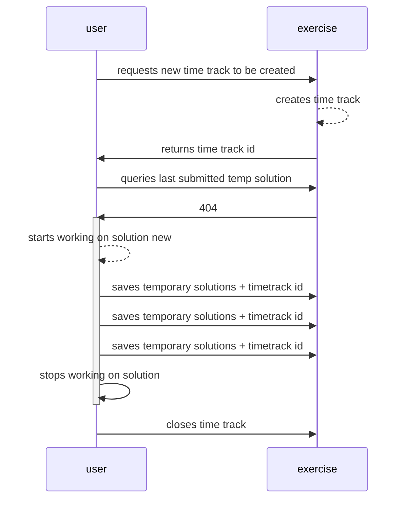
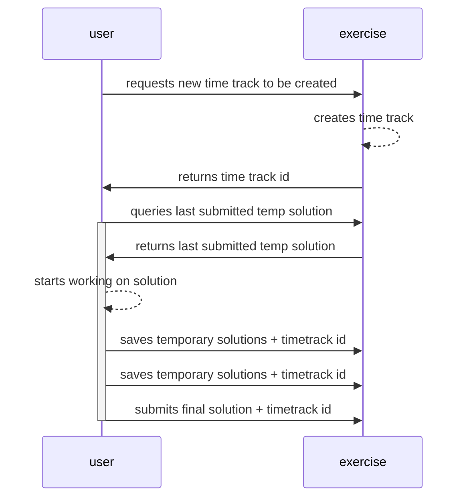

# What is STExS

STExS stands for Software Technology Examination System. This project is being developed by a group of students for the
Software Technology Module at TU Chemnitz.

This project is not production ready (and it is really not supposed to be used in production) as it is developed by
students as part of their course work.

- [Entwicklerhandbuch](./Entwicklerhandbuch.md)
- [Nutzerhandbuch](./benutzerhandbuch.md)
# How to run the project

## Recommended Dev Setup

- install Visual Studio 2022 or Jetbrains Rider
- install MS SQL Express 2019 => https://www.microsoft.com/de-de/sql-server/sql-server-downloads
- install the .NET 6 SDK => https://dotnet.microsoft.com/en-us/download/dotnet/6.0
- https://nodejs.org/en/ (download the lts version)
- run in an elevated shell

```
npm install -g yarn @angular/cli ng-openapi-gen;
dotnet tool install --global dotnet-ef
```

- open the STExS.sln file in Visual Studio or Rider
- press start to start the backend
    - it might ask whether to install the dev certificate, press yes
- open a new terminal in the frontend folder
- run `yarn quickstart`
- you can inspect the backend api routes on https://localhost:44345/api/swagger
- the frontend will be started on http://localhost:4200

## Helpful commands

- https errors: run `dotnet dev-certs https` to enable the development https certificate (this only works on windows and
  mac)

## in visual studio code

- install the c# extension

## From Cli

### Backend

- go to the STExS.Web folder
- `dotnet run`

### Frontend

- start the backend
- after the backend started successfully run (from the frontend directory):

```powershell
yarn quickstart;
```

# How to use libraries

## Entity Framework

- the main commands one might use are: `database update` and `migrations add {new migration name}`
- do not run them directly (insert them into the placeholder below)
- be sure that you are in the backend subfolder of this repo when running these commands
- Run before running any command: `set ASPNETCORE_ENVIRONMENT=Development`
- for Application database:
    - `dotnet ef --project Repositories --startup-project STExS.Web {command} --context ApplicationDbContext`
- For reference: https://stackoverflow.com/a/60959348

## Asp.Net Identity

- provisional login page is on /Identity/Account/Login
# Architecture
## Grading

---

---



- how the frontend works on a solution
- create timetrack
- work on solution
- save temp solution
- submit final solution
- close timetrack

- diagram when temp solution exists

- when the user submits a (temp) solution on a time track that is already closed a 403 is returned
- a time track is closed when the user submits a final solution
- time tracks can only be active for 48 hours

# Frontend

- start the backend
- after the backend started successfully run (from the frontend directory): `yarn quickstart`

- for Frontend documentation: `yarn docs`
- for Frontend tests: `yarn test` (chrome will open)
- for Frontend test-coverage: `yarn test-coverage` (see the generated .html file in /coverage/stex-s/)
